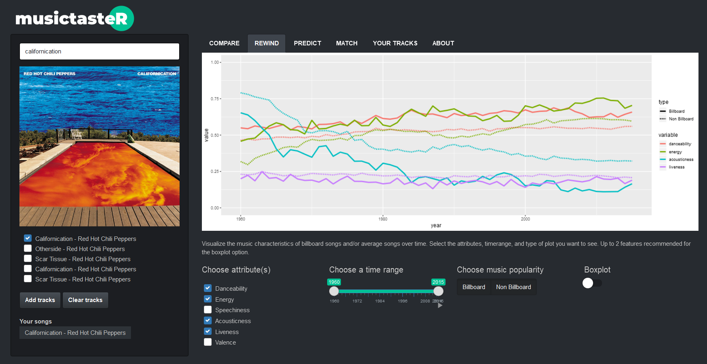
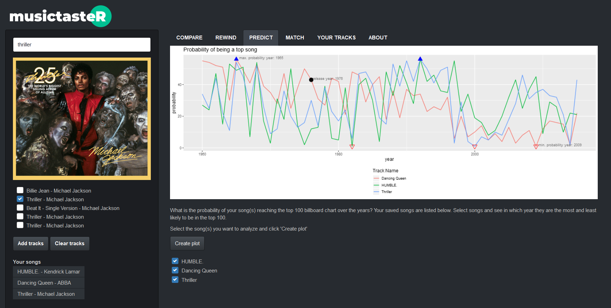
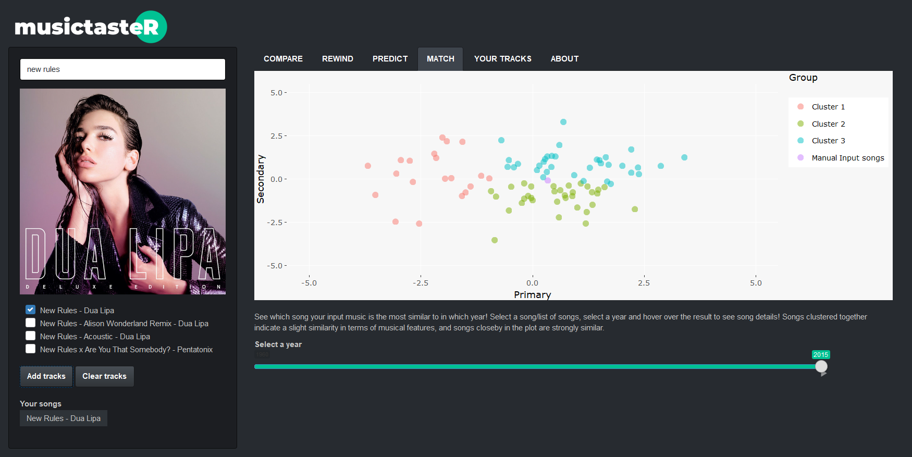

# musictasteR

## Overview
The package musictasteR was designed to compare and contrast the music features of top and average songs. We wanted to answer questions such as: what are the characteristics of popular songs? Are we able to predict the popularity of a given song? What songs are similar to each other in terms of their attrbiutes? 

To respond to this problem, we assembled more than 50k top songs (songs which have been featured in the Top100 Billboard chart) and 150k average songs over the years 1960 to 2015.

The main functionality of this package is the Shiny application, which allows to visualise, compare and cluster top and average songs according to their music characteristics. To be able to run the app, the user has to provide Spotify API credentials. This process is explained in the package vignette.

## Compare: Hover Plot

We initially wanted to explore the moods of the different songs by plotting them according to “energy” and “valence” (high energy and high valence are happy songs, high energy and low valence are any, etc.). As we have access to many more music characteristics with the Spotify API, we decided to expand this plot and make it functional with any characteristics. 

The function hover_plot_shiny displays a scatter plot according to 2 music characteristics and a given year chosen by the user. It also takes any song selected by the user and adds it to the scatter plot for comparison.   

## Rewind: Attributes Over Time

### Description

In order to visualize and compare the evolution of top and average song attributes (such as "valence", "danceability", etc.), we decided to implement the attributes_time function. 

This function plots overlapping variables (chosen by the user) of 2 different data sets as a function of the "year" column. In our case these two dataframes correspond to top and average songs ("Billboard" and "Non Billboard" respectively).

The song attributes can either be layed out as averages or as boxplots. The boxplot gives us more information about the data as it shows the distribution of each variable per year. Plotting averages on the other hand allows us to have a global overview of all the variables at the same time (boxplot plots only up to 2-3 variables clearly).

The choice to take as arguments 2 dataframes instead of 1 (with an additional column specifying the category of each dataset) was to avoid unnecessary formatting in case of very different datasets. If the user only needs to plot one overlapping feature in his 2 datasets, he does not need to match every column name to each other before applying the rbind function in order to store them as one dataframe. 

This was appropriate in our case as the billboard data was collected from a different source than that of average songs, but both contained the same music features from the Spotify API.
