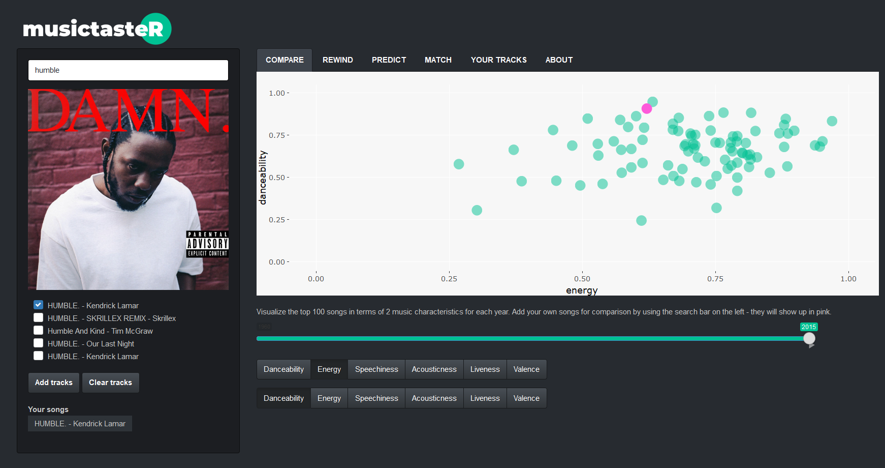

musictasteR
===========

Overview
--------

The package musictasteR was designed to compare and contrast the music features of top and average songs. We wanted to answer questions such as: what are the characteristics of popular songs? Are we able to predict the popularity of a given song? What songs are similar to each other in terms of their attrbiutes?

To respond to this problem, we assembled more than 50k top songs (songs which have been featured in the Top100 Billboard chart) and 150k average songs over the years 1960 to 2015.

The main functionality of this package is the Shiny application, which allows to visualise, compare and cluster top and average songs according to their music characteristics. To be able to run the app, the user has to provide Spotify API credentials. This process is explained in the package vignette.

``` r
# install.packages("devtools")
devtools::install_github(rubasic/musictasteR)
```

#### Compare

Comparing the audio attributes of Billboard songs to the songs added by the user. 

#### Rewind

Analyze the evolution of song characteristics over the past 60 years. 

#### Predict

Get the probability of the added songs reaching the top 100 Billboard chart over time. 

#### Match

Visualizing the similarity of top songs by grouping them together in clusters. Added songs will show up on the plot and allow the user to analyze which group of songs it is most similar to. 
